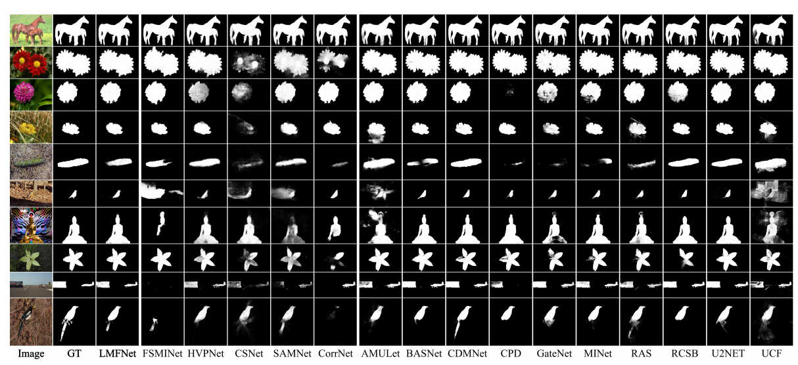

# LMFNet  
Lightweight Multi-Scale Feature Extraction with Fully Connected LMF Layer for Salient Object Detection

## 🔍 Abstract  
In the domain of computer vision, multi-scale feature extraction is vital for tasks such as salient object detection.  However, achieving this capability in lightweight networks remains challenging due to the trade-off between efficiency and performance.  This paper proposes a novel lightweight multi-scale feature extraction layer, termed the LMF layer, which employs depthwise separable dilated convolutions in a fully connected structure.  By integrating multiple LMF layers, we develop LMFNet, a lightweight network tailored for salient object detection.  Our approach significantly reduces the number of parameters while maintaining competitive performance.  Here, we show that LMFNet achieves state-of-the-art or comparable results on five benchmark datasets with only 0.81M parameters, outperforming several traditional and lightweight models in terms of both efficiency and accuracy.  Our work not only addresses the challenge of multi-scale learning in lightweight networks but also demonstrates the potential for broader applications in image processing tasks.

---

## Evaluation Code  
The related evaluation code can be found at:  
🔗 [https://github.com/zyjwuyan/SOD_Evaluation_Metrics](https://github.com/zyjwuyan/SOD_Evaluation_Metrics)

---

## Dataset  
Due to the large size of the training datasets, which are all publicly available, they are not included here.  
Users can download them independently and place them in the corresponding paths as specified in the code.

---

## Results  
The saliency detection result maps can be downloaded from the following link:  
🔗 [https://pan.baidu.com/s/1b1C2HbqwtHU2kTe7WujfdQ?pwd=4m66](https://pan.baidu.com/s/1b1C2HbqwtHU2kTe7WujfdQ?pwd=4m66)  

### Comparison 

